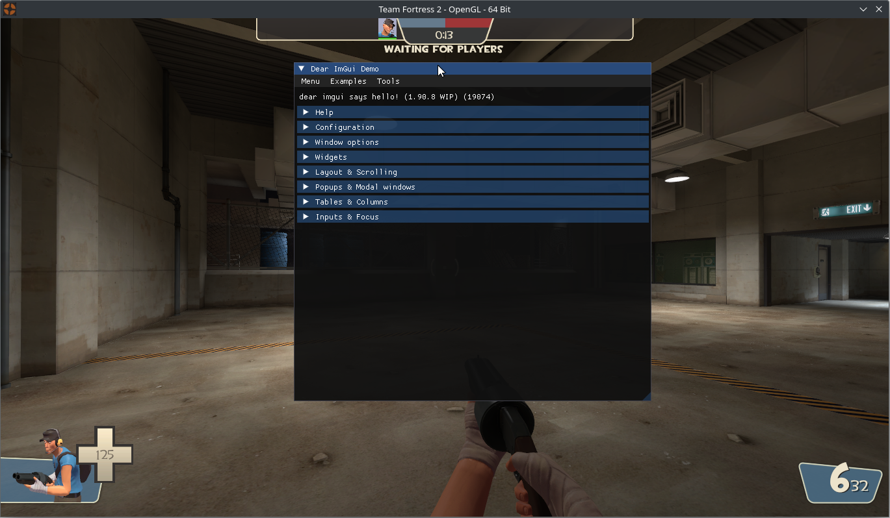

# TF2 ImGui-rs
Simple base with ImGui renderer for Team Fortress 2, written in Rust. Made as an example for my [Rust ImGui wrapper](https://github.com/nepcat/imgui_rs).

# Compiling
Clone this repo and compile it using nightly cargo
```bash
$ git clone --recurse-submodules https://github.com/nepcat/tf2_imgui_rs
$ cd tf2_imgui_rs
$ cargo build --release
```

# Injecting
TODO

# Dependencies
## Linux
* Freetype
* SDL2
## All platforms
* All listed dependencies from this [library](https://github.com/nepcat/imgui_rs?tab=readme-ov-file#dependencies)

# Supported platforms
* GNU/Linux x86_64
* Windows x86_64 (only GNU, see [this](https://github.com/nepcat/imgui_rs/issues/1))

# Screenshots
* OpenGL on Linux

* DirectX9 on Windows


# TODOS
* Fix color on Windows DX9
* Filter events on Window's WndProc hook
* Add support for Vulkan renderer on both Linux and Windows